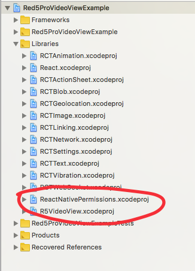
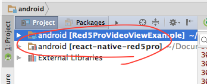
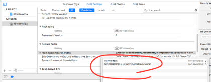
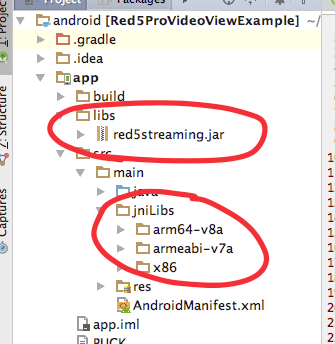

<h3 align="center">
  <a href="https://account.red5pro.com/register" target="_blank"></a>
</h3>

---

# react-native-red5pro

> This project is in **BETA**.

React Native Red5 Pro Publisher & Subscriber.

* [Install](#install)
  * [iOS](#ios)
  * [Android](#android)
* [Project Setup](#project-setup)
  * [iOS](#ios-project-setup)
  * [Android](#android-project-setup)
* [Project Libraries](#project-libraries)
  * [R5StreamModule](#r5streammodule)
  * [R5VideoView](#r5videoview)
* [R5StreamModule Usage](#r5streammodule-usage)
  * [Methods](#module-methods)
  * [Stream Properies](#module-stream-properties)
  * [Events](#module-events)
  * [Known Issues](#known-issues)
* [R5VideoView Usage](#r5videoview-usage)
  * [Properties](#component-properties)
  * [Methods](#component-methods)
  * [Event Callbacks](#component-event-callbacks)
  * [Publisher Example](#component-publisher-example)
  * [Subscriber Example](#component-subscriber-example)
* [Red5 Pro Quickstart](https://www.red5pro.com/docs/#overview)

> You will need a Red5 Pro SDK License and a Red5 Pro Server in order to use this component.  
[Sign up for a free trial!](https://account.red5pro.com/register)

# Install

Install the `react-native-red5pro` component:

```sh
$ npm i --save https://github.com/infrared5/react-native-red5pro/tarball/master
```

If you intend to use the live broadcasting capabilities of the [Red5 Pro SDK](https://www.red5pro.com/docs/streaming/), install the `react-native-permissions` module that will present to the user the permissions dialogs for Camera and Microphone:

```sh
$ npm i --save react-native-permissions
```

> More information about [react-native-permissions](https://github.com/yonahforst/react-native-permissions)

Finally, run the following to link the libraries into your projects:

## iOS

### using react-native link

```sh
$ react-native link
```

After running `react-native link`, the `react-native-red5pro` library - and optionally the `react-native-permissions` library - will be added to the *Libraries* of your iOS project:



### Troubleshooting

If the libraries were not adding using `react-native link`, you can drag them in manually. For the `react-native-red5pro` library:

1. Open a file browser and navigate to the *react-native-red5pro* install in *node_modules*.
2. Within the *node_modules/react-native-red5pro* directory, locate the `R5VideoView.xcodeproj` under *ios/R5VideoView*.
3. Drag the `R5VideoView.xcodeproj` file into your Xcode project and under the `Libraries` Group.

The `react-native-red5pro` library should now be installed and available.

_Follow similar instructions for `react-native-permissions`, if needed._

> > Review the [iOS Example](example/ios) included in this repository.

### using cocoaPods

Add the following to your Podfile:

```sh
pod 'ReactNativePermissions', :path => '../node_modules/react-native-permissions'
pod 'R5VideoView', :path => '../node_modules/react-native-red5pro'
```

Then issue a pod install as you would with any other project:

```sh
$ pod install
```

## Android

### using react-native link

```sh
$ react-native link
```

After running `react-native link`, the `react-native-red5pro` library will be added your Android project:



### Troubleshooting

If the `react-native-red5pro` library was not added using `react-naive link`, you can add them manually for Android by doing the follow in your project:

1. Locate and open the `settings.gradle` for your Android app.
2. Add `:react-native-red5pro` to the `include` and define the library project location:

```txt
rootProject.name = 'Red5ProVideoViewExample'

include ':app',
        ':react-native-red5pro'

project(':react-native-red5pro').projectDir = new File(rootProject.projectDir, '../../android')
```

Now locate the `build.gradle` for your Android app, and add the following to the `dependencies`:

```txt
compile project(':react-native-red5pro')
```

> Review the [Android Example](example/android) included in this repository.

# Project Setup

It is assumed that you have used the [create-react-native](https://github.com/react-community/create-react-native-app) CLI tool to bootstrap your projects. If you have used other means to set up your projects, some instructions may be different.

In addition to adding the `react-native-red5pro` library - and optionally `react-native-permissions` library - as [described above](#installation), there are additional project settings required, including the addition of the [Red5 Pro Mobile SDK](https://www.red5pro.com/docs/streaming/).

This section will describe how to setup your projects to integrate the [Red5 Pro Mobile SDK](https://www.red5pro.com/docs/streaming/) so you can use the `react-native-red5pro` library to display a video view for broadcasting and subscribing to a live stream.

> You will need a Red5 Pro SDK License and a Red5 Pro Server in order to use this component. [Sign up for a free trial!](https://account.red5pro.com/register)

## iOS Project Setup

After linking in the `react-native-red5pro` library as described in the [previous section](#installation), you will need to install the *Red5 Pro iOS SDK* and update the permissions for you project.

### Install Red5 Pro SDK

To integrate the *Red5 Pro iOS SDK*:

1. Download the latest [Red5 Pro iOS SDK](https://account.red5pro.com/download) from your account. If you don't have an account yet, [Sing up for a free trial!](https://account.red5pro.com/register).
2. Unpack the *Red5 Pro iOS SDK* into a location on your local machine - there will be a `R5Streaming.framework` file. This is the *Red5 Pro iOS SDK*.
3. Within your Xcode project panel, determine if you already have a `Frameworks` Group available for your project. If not, follow to step #4; if you have one, follow to step #5.
4. Right-Click on the top-level project, select `New Group` and when it is generated for the project, click on `New Group` to make it editable and name if `Frameworks`.
5. Drag the `R5Streaming.framework` file from a file browser into the Xcode project and under the `Frameworks` Group.
6. In the following dialog, select to `Copy items...` and ensure that your project is selected to add it to.
7. Click `Finish`.

The `R5Streaming.framework` should now be located within the `Frameworks` Group of your project. Select it and make note of its location (*Full Path*) in the Identities Panel of your Xcode project.

#### from react-native link installation

The `react-native-red5pro` library is not shipped with the *Red5 Pro SDK*. As such, we need to point the `react-native-red5pro` library point to the `R5Streaming.framework` dependency:

1. Locate the `R5VideoView.xcodeproj` under the `Libraries` Group of the Project Panel of Xcode.
2. Select the **Target** `R5VideoView`, and click `Build Settings`.
3. Search for "**frameworks**" (sans quotes), and navigate to the `Framework Search Paths`.
4. Click on the Value field and add the path to the `R5Streaming.framework` file (either relative or full path).



#### from cocoaPods installation

1. Locate the `Pods` project in your generated `xcworkspace` and select to open the project settings in Xcode.
2. Click on `Build Settings`
3. Search for "**frameworks**" (sans quotes), and navigate to the `Framework Search Paths`.
4. Click on the Value field and add the path to the `R5Streaming.framework` file (either relative or full path).

### Required Dependencies

The *Red5 Pro iOS SDK* requires a few additional dependencies in order to properly broadcast and consume live streams. Add the following libraries and frameworks to your project under the *General > Linked Frameworks and Libraries* panel:

```
libc++.1.tbd
libiconv.2.4.0.tbd
libbz2.1.0.tbd
libz.tbd

GLKit
QuartzCore
OpenAL
CoreFoundation
VideoToolbox
```

### Define Permissions

#### Camera & Microphone Access

If you intend to use the `react-native-red5pro` to broadcast live streams, you will need to add Privacy permissions for Camera and Microphone access on the device. To do so:

1. Locate the `Info.plist` file for your project in Xcode.
2. Click to Add an entry (using the `+` icon), and add a `Privacy - Camera Usage Description` entry.
3. Provide a String Value of the message you want to present to your User(s) - e.g., `Camera access required for publishing.`
4. Add a similar entry and String value for `Privacy - Microphone Usage Description`.

Your app should now be available for broadcasting and subscribing to live streams!

#### Background Services

If you intend to use the `react-native-red5pro` to continue broadcasting and/or playback while the app is in the background, you will additionally need to define the ability to do so:

1. Locate the `Info.plist` file for your project in Xcode.
2. Click to Add an entry (using the `+` icon), and add a `Required background modes` entry.
3. In the generated `Item 0` entry, add a String value of `App plays audio or streams audio/video using AirPlay`.

Now you can use the `enableBackgroundStreaming` of the library to enable background streaming!

### Additional Notes

* You may bew required to set the `Enable Bitcode` Build Setting to a value of `No` in order to use the SDK.

## Android Project Setup

After linking in the `react-native-red5pro` library as described in the [previous section](#installation), you will need to install the *Red5 Pro Android SDK* and update the permissions for you project.

### Install Red5 Pro SDK

To integrate the *Red5 Pro Android SDK*:

1. Download the latest [Red5 Pro Android SDK](https://account.red5pro.com/download) from your account. If you don't have an account yet, [Sing up for a free trial!](https://account.red5pro.com/register).
2. Unpack the *Red5 Pro Android SDK* into a location on your local machine - there will be a `red5streaming.jar` file and a folder labelled `jniLibs`. This is the *Red5 Pro Android SDK*.
3. Drag the `red5streaming.jar` file into the *app/libs* folder of your Android app project in Android Studio.
4. Drag the `jniLibs` holder under the *app/src/main* folder of your Android app project in Android Studio.



The `react-native-red5pro` library is not shipped with the *Red5 Pro SDK*. As such, we need to point the `react-native-red5pro` library point to the `red5streaming.jar` dependency:

1. Expand the `react-native-red5pro` library in the Project Paenl of Android Studio.
2. Locate the `build.gradle` file and open it in the editor.
3. Add the path to the `red5streaming.jar` as a dependency. e.g.,

```txt
dependencies {
    provided "com.facebook.react:react-native:${_reactNativeVersion}"
    compile files("../example/android/app/libs/red5streaming.jar")
}
```

Now that the *Red5 Pro Android SDK* is a dependency for the `react-native-red5pro` library and is referenced from the parent project, we need to make sure we exclude it from being compiled in twice:

1. Locate the `build.gradle` for your Android **app** and open it in the editor.
2. Define the `red5sreaming.jar` as an exclusion for the **libs** dependencies.

The `dependencies` definition in the `build.gradle` of the **app** should look similar to the following:

```txt
dependencies {
    compile fileTree(dir: "libs", include: ["*.jar"], excludes: ["red5streaming.jar"])
    compile "com.android.support:appcompat-v7:23.0.1"
    compile "com.facebook.react:react-native:+"  // From node_modules
    compile project(':react-native-red5pro')
}
```

### Add `R5Package` to your App

1. Open you main `ReactApplication` implementation file.
2. Within the `getPackages()` override, add a new instance of `R5Package` to the list, e.g.,:

```java
private final ReactNativeHost mReactNativeHost = new ReactNativeHost(this) {
  @Override
  public boolean getUseDeveloperSupport() {
    return BuildConfig.DEBUG;
  }

  @Override
  protected List<ReactPackage> getPackages() {
    return Arrays.<ReactPackage>asList(
        new MainReactPackage(),
        new R5Package()
    );
  }

  @Override
  protected String getJSMainModuleName() {
    return "index.android";
  }
};
```

### Define Permissions

#### Camera, Microphone and Network

If you intend to use the `react-native-red5pro` to broadcast live streams, you will need to add Privacy permissions for Camera and Microphone access on the device. To do so:

1. Open the `AndroidManifest.xml` file and add the following to the `uses-permissions`:

```xml
<uses-permission android:name="android.permission.RECORD_AUDIO" />
<uses-permission android:name="android.permission.CAMERA" />
<uses-permission android:name="android.permission.CAPTURE_AUDIO_OUTPUT" />
<uses-permission android:name="android.permission.ACCESS_NETWORK_STATE" />
<uses-permission android:name="android.permission.ACCESS_WIFI_STATE" />
<uses-permission android:name="android.permission.READ_PHONE_STATE" />
<uses-permission android:name="android.permission.WRITE_EXTERNAL_STORAGE" />
```

1. With the `AndroidManifest.xml` still open, under the `uses-permissions`, add the following `uses-feature`s:

```xml
<uses-feature
  android:name="android.hardware.camera"
  android:required="false" />
<uses-feature
  android:name="android.hardware.camera.front"
  android:required="false" />
```

Your app should now be available for broadcasting and subscribing to live streams!

#### Background Services

The librayr provides background services for broadcasting and/or playback of stream while the app is in the background. You will need to add the following to your `AndroidManifest.xml` file in order to enable these services:

```
<service android:name="com.red5pro.reactnative.view.PublishService" />
<service android:name="com.red5pro.reactnative.view.SubscribeService" />
```

# Available Libraries

Included in the `react-native-red5pro` project are two libraries that can be used (together, no less!) in your React Native App:

* `R5StreamModule`
* `R5VideoView`

## R5StreamModule

The `R5StreamModule` is a Native Module.

The `R5StreamModule` is used to establish a streaming session without requiring a correspnding view to display and render the stream in your App on a UI View. This can be useful when the App only requires playing back the audio of a stream, or not requiring a publisher preview view, along with other feature scenarios.

The original reason for developing and including the `R5StreamModule` was to allow a previously established stream to be detached and reattached to `R5VideoView` instance when the UI state of the App requires a change in your project. By using the `R5StreamModule` you can maintain the previously established publisher or subscriber session while updating the view state - all while not interrupting the stream.

To initialize a stream session, from which you can start a publisher or subscriber stream, you initilize/register the configuration using the `R5StreamModule.init` method which returns a `Promise`:

```
this.streamId = undefined // will be defined in success and utilized in lifecycle API.
R5StreamModule.init('<uniquestreamid>', configuration)
  .then(streamId => {
    this.streamId = streamId
  })
  .catch(error => {
    // error occurred in initialization.
  })
```

For publishers, the `<uniquestreamid>` can be the stream name you will publish with. For subscriber, the `<uniquestreamid>` will be a unique subscriper id.

> To Learn more about the `R5StreamModule` Usage, see [Module Usage](#r5streammodule-usage)

## R5VideoView

The `R5VideoView` is a Native Component.

The `R5VideoView` is used to declare a UI view instance that a stream will be shown - either the Publisher preview or the Subscriber stream playback.

The `R5VideoView` is declared similar to the following and is recommended to retain a reference for other node handling and interaction:

```js
render () {
  const { videoProps } = this.props
  const assignVideoRef = (video) => { this.red5pro_video_publisher = video }
  return (
    <View>
      <R5VideoView
        {...videoProps}
        ref={assignVideoRef.bind(this)}
      />
    </View>
  )
}
```

> To Learn more about the `R5VideoView` Usage, see [Component Usage](#component-usage)

# R5StreamModule Usage

The following describe the API available for the `react-native-red5pro` Native Module library, `R5StreamModule`.

## Module Methods

The methods available on the `R5StreamModule` require the retention of a `stream id` established during initialization in order to access the associated stream instance to interact with.

| Name | Arguments | Description | Publisher | Subscriber |
| :-- | :-- | :-- | :--: | :--: |
| init | `<stream-id>`, `configuration` | Request to intialize a configuration for a stream with an associated, unique stream id. | x | x |
| publish | `<stream-id>`, `streamType`, `streamProps` | Request to start broadcasting stream with unique name and type (0: `live`, 1: `record`, `2`: append) and additional properties to use in broadcast. _See [Module Stream Properties](#module-stream-properties)._ | x | |
| unpublish | `<stream-id>` | Request to stop broadcast. | x | |
| subscribe | `<stream-id>`, `streamProps` | Request to start playback of stream with additional properties to use in playback. _See [Module Stream Properties](#module-stream-properties)._ | | x |
| unsubscribe | `<stream-id>` | Request to stop playback. | | x |
| swapCamera | `<stream-id>` | Request to swap camera on device, from front-facing to back-facing and vice-versa. | x | |
| muteAudio | `<stream-id>` | Request to not send audio on broadcast during a publish session. | x | |
| unmuteAudio | `<stream-id>` | Request to send audio on broadcast during a publish session. | x | |
| muteVideo | `<stream-id>` | Request to not send video on broadcast during a publish session. | x | |
| unmuteVideo | `<stream-id>` | Request to send video on broadcast during a publish session. | x | |
| setPlaybackVolume | `<stream-id>` | Request to set playback volume. _From `0` to `100`._ | | x |

It should be noted that the following methods return a `Promise` object:

* `init`
* `publish`
* `unpublish`
* `subscribe`
* `unsubscribe`

## Module Stream Properties

The following stream properties are available for a `R5StreamModule`:

| Key | Type | Default | Description | Publisher | Subscriber |
| :-- | :-- | :-- | :-- | :--: | :--: |
| showDebugView | boolean | false | Displays the debug information for a broadcast and playback stream. | x | x |
| logLevel | int | 3 | Enumerated value of [R5LogLevel](src/enum/R5VideoView.loglevel.js). | x | x |
| scaleMode | int | 0 | Enumerated value of [R5ScaleMode](src/enum/R5VideoView.scalemode.js). | x | x |
| publishVideo | boolean | true | Flag to include video in broadcast. | x | |
| publishAudio | boolean | true | Flag to include audio in broadcast. | x | |
| subscribeVideo | boolean | true | Flag to include video in subscription. | x | |
| cameraWidth | int | 640 | Width dimension of Camera to use in broadcast. | x | |
| cameraHeight | int | 360 | Height dimension of Camera to use in broadcast. | x | |
| bitrate | int | 750 | The video bitrate to broadcast at. | x | |
| framerate | int | 15 | The video framerate to broadcast at. | x | |
| audioBitrate | int | 32 | The audio bitrate to broadcast at (kb/s). | x | |
| audioSampleRate | int | iOS: `16000`, Android: `44100` | The audio sample rate to broadcast at (hz).  | x | |
| useAdaptiveBitrateController | boolean | false | Use of adaptive bitrate streaming for broadcasting.  | x | |
| useBackfacingCamera | boolean | false | Use the backfacing camera of the device to start broadcasting. | x | |
| audioMode | int | 0 | Enumerated value of [R5AudioMode](src/enum/R5VideoView.audiomode.js). | x | x |
| enableBackgroundStreaming | boolean | false | Turns on ability to continue to publish or subscribe to audio while app is in the background. | x | x |

These properties represent the settings for a Publisher and Subscriber session that do not necessarily rely on a corresponding UI view (such as the `R5VideoView` component).

## Module Events

In addition to the `Promise` objects returned on the `init`, `publish`, `unpublish`, `subscribe` and `unsubscribe` methods, there are events on the `R5StreamModule` that can listened to using the `NativeEventEmitter` from React Native.

The following events are available:

| Name | Event Object | Description | Publisher | Subscriber |
| :-- | :-- | :-- | :--: | :--: |
| onConfigured | {`key`: `<configuration.key provided>`} | Notification of configuration being completed. | x | x |
| onMetaDataEvent | {`metadata`: `<server provided info about stream>`} | Notification of stream metadata. | | x |
| onPublisherStreamStatus | {`status`: [refer to status section](#status-callback-objects)} | Notification of stream status for a Publisher. | x | |
| onSubscriberStreamStatus | {`status`: [refer to status section](#status-callback-objects)} | Notification of stream status for a Subscriber. | | x |
| onUnsubscribeNotification | none | Notification of stop of playback. | | x |
| onUnpublishNotification | none | Notification of stop of broadcast. | x | |

To establish a listener for these events, you must first establish a `NativeEventEmiiter` instance using the `R5StreamModule`:

```js
import { NativeEventEmiiter } from 'react-native'
import { R5StreamModule } from 'react-native-red5pro'
...
this.emitter = new NativeEventEmiiter(R5StreamModule)
```

Once an emitter is established, use the `addListener` method, e.g,:

```js
this.emitter.addListener('onMetaDataEvent', this.onMetaData)
```

To remove event listeners:

```js
this.emitter.removeAllListeners('onMetaDataEvent')
```

## Known Issues

### Issue 1.0 - Android Publisher

The Android SDK requires reading data from the camera previous display in order to send video data to the server. As such, when there is no associated "attached" `R5VideoView` to the publisher stream, no video data will be delivered to subscribers.

# R5VideoView Usage

The following describe the API available for the `react-native-red5pro` Native Component library, `R5VideoView`.

## Component Properties

| Key | Type | Default | Description | Publisher | Subscriber |
| :-- | :-- | :-- | :-- | :--: | :--: |
| showDebugView | boolean | false | Displays the debug information for a broadcast and playback stream. | x | x |
| logLevel | int | 3 | Enumerated value of [R5LogLevel](src/enum/R5VideoView.loglevel.js). | x | x |
| scaleMode | int | 0 | Enumerated value of [R5ScaleMode](src/enum/R5VideoView.scalemode.js). | x | x |
| streamType | int | 0 | Enumerated value of [R5PublishType](src/enum/R5VideoView.publishtype.js). | x | |
| publishVideo | boolean | true | Flag to include video in broadcast. | x | |
| publishAudio | boolean | true | Flag to include audio in broadcast. | x | |
| subscribeVideo | boolean | true | Flag to include video in subscription. | x | |
| cameraWidth | int | 640 | Width dimension of Camera to use in broadcast. | x | |
| cameraHeight | int | 360 | Height dimension of Camera to use in broadcast. | x | |
| bitrate | int | 750 | The video bitrate to broadcast at. | x | |
| framerate | int | 15 | The video framerate to broadcast at. | x | |
| audioBitrate | int | 32 | The audio bitrate to broadcast at (kb/s). | x | |
| audioSampleRate | int | iOS: `16000`, Android: `44100` | The audio sample rate to broadcast at (hz).  | x | |
| useAdaptiveBitrateController | boolean | false | Use of adaptive bitrate streaming for broadcasting.  | x | |
| useBackfacingCamera | boolean | false | Use the backfacing camera of the device to start broadcasting. | x | |
| audioMode | int | 0 | Enumerated value of [R5AudioMode](src/enum/R5VideoView.audiomode.js). | x | x |
| enableBackgroundStreaming | boolean | false | Turns on ability to continue to publish or subscribe to audio while app is in the background. | x | x |
| zOrderOnTop | boolean | false | Setting of layout order of stream view. _Android only._ | x | x |
| zOrderMediaOverlay | boolean | false | Setting of layout order of stream view. _Android only._ | x | x |
| configuration | shape | `REQUIRED` | [Refer to Configuration Properties](#component-configuration-properties). | x | x |

## Component Configuration Properties

The following are the `configuration` properties of the Properties of the `react-native-red5pro` library. This is required to properly setup a broadcasting or playback session of a stream on the *Red5 Pro Server*.

These properties are required for **both** Publishers and Subscribers.

| Key | Type | Default | Description |
| :-- | :-- | :-- | :-- |
| host | string | `REQUIRED` | The IP or Fully Qualified Domain Name of where the *Red5 Pro Server* is deployed. |
| port | int | `REQUIRED` | The port number that is exposed on the *Red5 Pro Server* to access RTSP connections. |
| streamName | string | `REQUIRED` | The unique name of the stream to broadcast on or subscribe to. |
| contextName | string | `REQUIRED` | The target *webapp* to stream to or access streams from. _Typically, `live`._ |
| licenseKey | string | `REQUIRED` | The SDK license key provided with your registered *Red5 Pro* account. |
| bundleID | string | `REQUIRED` | A unique (typically inversed domain name) descriptor for you app. _Required for some stores._ |
| bufferTime | number | 0.5 | Default buffer. |
| streamBufferTime | number | 4 | Default buffer for subscribers to allow on the server in sending packets. |
| parameters | string | none | Optional connection parameters. Often used for authentication. ***[See Note Below](#parameters-configuration-property)** |
| autoAttachView | boolean | `true` | A flag to also attach the view component to a stream upon setup. |
| key | string | `REQUIRED` | Unique key to be used internally to access the configuration object. |

### Component Parameters Configuration Property

The `parameters` configuration provides the ability to pass in additional properties to be used by the target application accepting the RTSP connection from a publisher or subscriber.

Typically, this is used for authentication purposes and requires custom modifications on the server.

The structure is key/value pairs delimited by a `;`. For example:

```js
let auth = 'username=foo;password=bar;'
```

> See [iOS Example](https://github.com/red5pro/streaming-ios/blob/master/R5ProTestbed/Tests/PublishAuth/PublishAuthTest.swift) and [Android Example](https://github.com/red5pro/streaming-android/blob/master/app/src/main/java/red5pro/org/testandroidproject/tests/PublishAuthTest/PublishAuthTest.java).


## Component Methods

The following methods are available:

```js
import { subscribe,
         unsubscribe,
         publish,
         unpublish,
         swapCamera,
         updateScaleMode,
         setPlaybackVolume,
         muteAudio,
         unmuteAudio,
         muteVideo,
         unmuteVideo,
         attach,
         detach
} from 'react-native-red5pro'
```

| Name | Arguments | Description | Publisher | Subscriber |
| :-- | :-- | :-- | :--: | :--: |
| subscribe | `<ref>`, `streamName` | Request to start subscribing to stream. | | x |
| unsubscribe | `<ref>` | Request to stop playback of stream. | | x |
| publish | `<ref>`, `streamName`, `streamType` | Request to start broadcasting stream with unique name and type (0: `live`, 1: `record`, `2`: append). | x | |
| unpublish | `<ref>` | Request to stop broadcast. | x | |
| swapCamera | `<ref>` | Request to swap camera on device, from front-facing to back-facing and vice-versa. | x | |
| updateScaleMode | `<ref>`, `mode` | Request to change playback scalemode (0: `fill with aspect ratio`, 1: `fit, with letterboxing`, 2: `fill to view`). | | x |
| setPlaybackVolume | `<ref>`, `int` | Request to set playback volume. _From `0` to `100`._ | | | x |
| muteAudio | `<ref>` | Request to not send audio on broadcast during a publish session. | x | |
| unmuteAudio | `<ref>` | Request to send audio on broadcast during a publish session. | x | |
| muteVideo | `<ref>` | Request to not send video on broadcast during a publish session. | x | |
| unmuteVideo | `<ref>` | Request to send video on broadcast during a publish session. | x | |
| attach | `<ref>`, `stream-id` | Request to attach a stream to the view. | x | x |
| detach | `<ref>`, `stream-id` | Request to detach a stream from the view. | x | x |

> In the case of the `attach` and `detach` methods, a previously established stream will need to be available in the app which is associated with the `stream id`. As such, a previous call to `subscribe` or `publish` is required to register the stream for a Subscriber or Publisher client, respectively.

## Component Event Callbacks

The following callbacks are available:

| Name | Event Object | Description | Publisher | Subscriber |
| :-- | :-- | :-- | :--: | :--: |
| onConfigured | {`key`: `<configuration.key provided>`} | Notification of configuration being completed. | x | x |
| onMetaData | {`metadata`: `<server provided info about stream>`} | Notification of stream metadata. | | x |
| onPublisherStreamStatus | {`status`: [refer to status section](#status-callback-objects)} | Notification of stream status for a Publisher. | x | |
| onSubscriberStreamStatus | {`status`: [refer to status section](#status-callback-objects)} | Notification of stream status for a Subscriber. | | x |
| onUnsubscribeNotification | none | Notification of stop of playback. | | x |
| onUnpublishNotification | none | Notification of stop of broadcast. | x | |

### Component Status Callback Objects

The Publishers and Subscribers receive status events during the lifecycle of broadcasting and consuming a stream, respectively. The following properties are available in the status object:

| Key | Description |
| :-- | :-- |
| code | The enumerated code of the event. |
| name | The associated name of the event. |
| message | The human readable, optional, message associated with the event. |
| streamName | The associated stream. |

* The enumerated list of statuses on iOS [https://www.red5pro.com/docs/static/ios-streaming/protocol_r5_stream_delegate-p.html](https://www.red5pro.com/docs/static/ios-streaming/protocol_r5_stream_delegate-p.html)
* The enumerated list of statuses on Android [https://www.red5pro.com/docs/static/android-streaming/enumcom_1_1red5pro_1_1streaming_1_1event_1_1_r5_connection_event.html](https://www.red5pro.com/docs/static/android-streaming/enumcom_1_1red5pro_1_1streaming_1_1event_1_1_r5_connection_event.html)

## Component Publisher Example

You will need to have a Red5 Pro SDK license and access to a reployed Red5 Pro Server in order to use the following example.

> [Sign up for a free trial of Red5 Pro!](https://account.red5pro.com/register)

```js
import React from 'react'
import { findNodeHandle, View, Button, StyleSheet } from 'react-native'

import { R5VideoView } from 'react-native-red5pro'
import { R5LogLevel } from 'react-native-red5pro'
import { publish,
         unpublish,
         swapCamera } from 'react-native-red5pro'

export default class App extends React.Component {

  constructor (props) {
    super(props)

    this.state = {
      publisher: {
        ref: 'video',
        configuration: {
          host: 'your.red5pro.deploy', // IP or Fully Qualified Domain Name
          port: 8554,
          contextName: 'live',
          bufferTime: 0.5,
          streamBufferTime: 2,
          key: Math.floor(Math.random() * 0x10000).toString(16),
          bundleID: 'com.red5pro.example',
          licenseKey: 'YOUR-LICENSE-KEY',
          streamName: 'mystream'
        },
        showDebugView: true,
        logLevel: R5LogLevel.DEBUG,
        onConfigured: this.onConfigured.bind(this)
      }
    }

    this.onStop = this.onStop.bind(this)
    this.onSwapCamera = this.onSwapCamera.bind(this)

  }

  render () {

    return (
      <View style={styles.container}>
        <R5VideoView {...this.state.publisher} style={styles.video} />
        <Button
          style={styles.button}
          onPress={this.onStop}
          title='Stop'
          accessibilityLabel='Stop'
          />
        <Button
          style={styles.button}
          onPress={this.onSwapCamera}
          title='Swap Camera'
          accessibilityLabel='Swap Camera'
          />
      </View>
    )

  }

  onConfigured () {
    // By providing the `configuration` state prop to the view,
    // the component starts the configuration process.

    const streamName = this.state.publisher.configuration.streamName
    publish(findNodeHandle(this.refs.video), streamName)

  }

  onStop () {

    unpublish(findNodeHandle(this.refs.video))

  }

  onSwapCamera () {

    swapCamera(findNodeHandle(this.refs.video))

  }

}

const styles = StyleSheet.create({
  container: {
    flex: 1,
    backgroundColor: 'white',
    justifyContent: 'center'
  },
  video: {
    flex: 1,
    flexDirection: 'row',
    backgroundColor: 'black'
  },
  button: {
    position: 'absolute',
    left: 0,
    right: 0,
    bottom: 0,
    height: 40,
    backgroundColor: 'blue',
    color: 'white'
  }
})
```

## Component Subscriber Example

You will need to have a Red5 Pro SDK license and access to a reployed Red5 Pro Server in order to use the following example.

> [Sign up for a free trial of Red5 Pro!](https://account.red5pro.com/register)

```js
import React from 'react'
import { findNodeHandle, View, Button, StyleSheet } from 'react-native'

import { R5VideoView } from 'react-native-red5pro'
import { R5LogLevel, R5ScaleMode } from 'react-native-red5pro'
import { subscribe,
         unsubscribe,
         updateScaleMode } from 'react-native-red5pro'

export default class App extends React.Component {

  constructor (props) {
    super(props)

    this.state = {
      subscriber: {
        ref: 'video',
        configuration: {
          host: 'your.red5pro.deploy', // IP or Fully Qualified Domain Name
          port: 8554,
          contextName: 'live',
          bufferTime: 0.5,
          streamBufferTime: 2,
          key: Math.floor(Math.random() * 0x10000).toString(16),
          bundleID: 'com.red5pro.example',
          licenseKey: 'YOUR-LICENSE-KEY',
          streamName: 'mystream'
        },
        showDebugView: true,
        logLevel: R5LogLevel.DEBUG,
        scaleMode: R5ScaleMode.SCALE_TO_FILL,
        onConfigured: this.onConfigured.bind(this)
      }
    }

    this.scaleMode = this.state.subscriber.scaleMode
    this.onScaleMode = this.onScaleMode.bind(this)

    this.onStop = this.onStop.bind(this)

  }

  render () {

    return (
      <View style={styles.container}>
        <R5VideoView {...this.state.subscriber} style={styles.video} />
        <Button
          style={styles.button}
          onPress={this.onStop}
          title='Stop'
          accessibilityLabel='Stop'
          />
        <Button
          style={styles.button}
          onPress={this.onScaleMode}
          title='Swap Scale Mode'
          accessibilityLabel='Swap Scale Mode'
          />
      </View>
    )

  }

  onConfigured () {
    // By providing the `configuration` state prop to the view,
    // the component starts the configuration process.

    const streamName =  this.state.subscriber.configuration.streamName
    subscribe(findNodeHandle(this.refs.video), streamName)

  }

  onStop () {

    unsubscribe(findNodeHandle(this.refs.video))

  }

  onScaleMode () {

    let scale = this.scaleMode + 1
    if (scale > 2) {
      scale = 0
    }
    this.scaleMode = scale
    updateScaleMode(findNodeHandle(this.refs.video), scale)

  }

}

const styles = StyleSheet.create({
  container: {
    flex: 1,
    backgroundColor: 'white',
    justifyContent: 'center'
  },
  video: {
    flex: 1,
    flexDirection: 'row',
    backgroundColor: 'black'
  },
  button: {
    position: 'absolute',
    left: 0,
    right: 0,
    bottom: 0,
    height: 40,
    backgroundColor: 'blue',
    color: 'white'
  }
})
```

> For more in-depth examples, please refer to the [examples](examples) included in this repository.

